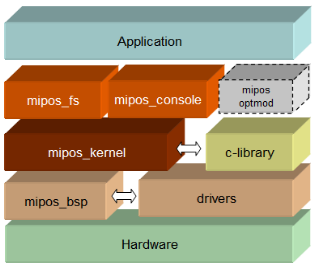
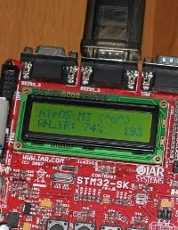
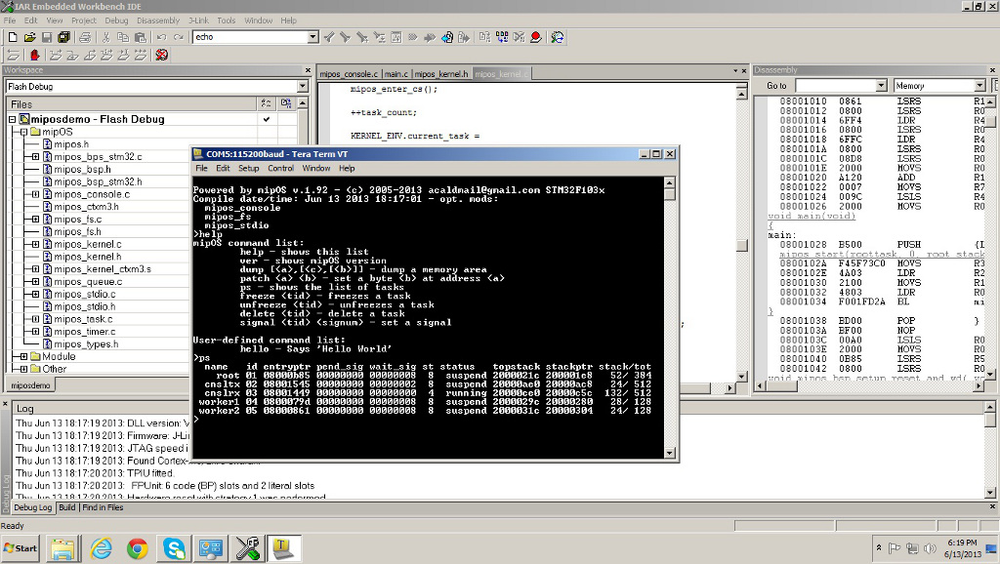

| Linux  | [](https://travis-ci.org/eantcal/mipos)  |

Multum In Parvo Operating System is a cooperative multitasking RTOS designed for single-chip micro-controllers with severely limited RAM (e.g. less than 256 bytes) and ROM. It provides the flexibility of an RTOS in low-cost embedded designs.
System-On-Chip (SoC) programmers can choose mipOS for its small, fast and royalty-free benefits.

mipOS manages tasks, providing mutual exclusion, signals, message queues, memory management, malloc, memory pools, timers.
Optional modules include: command line support, file system and stdio support.



mipOS is designed to be as compact as possible for the target architecture. Its small footprint enables use in devices with limited memory capacity, including on-chip in SoC implementations, and that reduces power demands, extending battery life.

Small size also makes mipOS easy to understand and use. Computer science students can enhance their understanding of a simple OS and gain valuable practical experience modifying it, for example introducing new features.

mipOS is highly portable: it is written mainly in C programming language.
mipOS is free for any use.

It is also royalty-free, ideal for applications with high-volume production needs.


The original design and the source code was published in an article for the magazine Computer Programming where the internals of a portable and scalable kernel for microcontrollers with severely limited resource are described.

mipOS has been tested on Intel x86 chip, STMicroelectronics® ST7 microcontrollers, STM8 microcontroller and STM32 32bit, ARM-Cortex M3 microcontroller families.



See also: [https://www.eantcal.eu/home/mipos](https://www.eantcal.eu/home/mipos).



mipOS can be executed on Windows™ or Linux user-space process for simulation purposes (both Microsoft® Visual Studio™ and GCC compilers are supported).
mipOS is delivered in fully documented source code form. 

To build the examples on Linux (target: ``simu``) you might do the following steps:
- Make sure you have installed gcc multilib (on Ubuntu you can install it by using ``sudo apt-get install gcc-multilib``)
- Go to mipos/examples directory
- Create a new directory (e.g. ``md build``)
- Enter new directory (e.g. ``cd build``)
- Run ``cmake .. && make``

In ``build`` several binaries will be created with prefix ``example-``. 
For example, if you run ``./example-filesystem``, will be loaded mipos within a linux process, it will mount a disk image containing two files, as shown in the following demo:

```
~/repos/mipos/examples/build$ ./example-filesystem 

mipOS v.1.99 - (c) 2005-2017 antonino.calderone@gmail.com console
Compile date/time: Dec 27 2020 00:33:50 - opt. mods:
  mipos_console
  mipos_fs
  mipos_stdio
  mipos_mm
  mipos_malloc
  mipos_mpool

mipOS>help
	help - shows this list
	ver - shows mipOS version
	dump [<a>,[<c>,[<b>]] - dump a memory area
	patch <a> <b> - set a byte <b> at address <a>
	ps - shows the list of tasks
	freeze <tid> - freezes a task
	unfreeze <tid> - unfreezes a task
	delete <tid> - delete a task
	signal <tid> <signum> - set a signal
	ls - shows list of files
	cat - shows list and content of files

mipOS>ls
Volume label RAMDISK
test1       60 bytes
test2       60 bytes

mipOS>cat test1
Volume label RAMDISK
test1       60 bytes
0123456789abcdefghijklmnopqrstuvwxyz0123ABCDEFGHIJKLMNOPQRST
test2       60 bytes
9876543210ABCDEFGHIJKLMNOPQRSTUVWXYZ0123abcdefghijklmnopqrst

mipOS>

```

