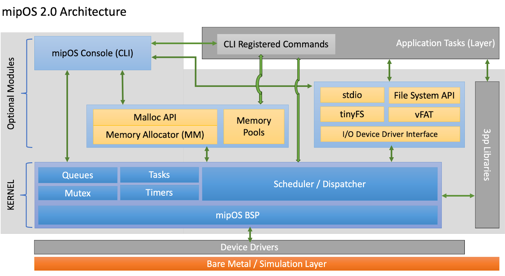
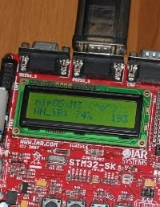
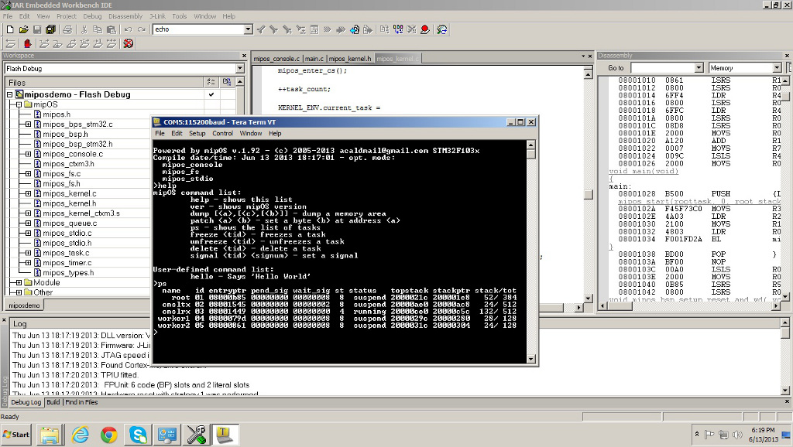

# mipOS

[](https://github.com/eantcal/mipos/actions/workflows/ci.yml)


Multum In Parvo Operating System is a cooperative multitasking RTOS designed
for single-chip microcontrollers with severely limited RAM and ROM. It provides
tasks, mutual exclusion, signals, message queues, memory management, malloc,
memory pools, timers, and optional console, file-system, and stdio support.

mipOS is written mainly in C and is intended to stay compact, portable, and easy
to study. It can also run as a user-space simulator on Windows, Linux, and macOS.



The original design and source code were published in an article for the
magazine Computer Programming, describing the internals of a portable and
scalable kernel for resource-constrained microcontrollers.

mipOS has been tested on Intel x86/x64 simulator targets, STM8, STM32, and
ARM Cortex-M3 microcontroller families. The simulator also builds on ARM64
hosts; on macOS ARM64, the C/C++ unit tests run but the cooperative scheduler
smoke test is disabled because the simulator context-switch backend is not
currently supported on Apple Silicon.



See also: [https://www.eantcal.eu/home/mipos](https://www.eantcal.eu/home/mipos).
For release notes and recent project changes, see [NEWS.md](NEWS.md).



## Building

CMake is the supported entry point for desktop simulator builds. The old
checked-in Visual Studio solution and project files have been removed; generate
Visual Studio solutions on demand from CMake instead.

### Windows, Visual Studio x64

```powershell
cmake -S . -B build-vs-x64 -G "Visual Studio 18 2026" -A x64
cmake --build build-vs-x64 --config Release --parallel
```

For Visual Studio 2022, use:

```powershell
cmake -S . -B build-vs-x64 -G "Visual Studio 17 2022" -A x64
```

### Windows, Visual Studio x86

```powershell
cmake -S . -B build-vs-win32 -G "Visual Studio 18 2026" -A Win32
cmake --build build-vs-win32 --config Release --parallel
```

### Linux or macOS, native architecture

```sh
cmake -S . -B build
cmake --build build --parallel
```

The native build supports x86-64 and AArch64 hosts. On Apple Silicon, CMake
builds the simulator natively and runs the non-scheduler unit tests; the
cooperative scheduler smoke test is skipped because the simulator context
switching backend is not supported on macOS ARM64.

### Linux x64

```sh
cmake -S . -B build-linux-x64 -DMIPOS_ARCH=x64
cmake --build build-linux-x64 --parallel
```

### Linux x86

```sh
cmake -S . -B build-linux-x86 -DMIPOS_ARCH=x86
cmake --build build-linux-x86 --parallel
```

Linux x86 builds require a 32-bit multilib toolchain and runtime. On Debian or
Ubuntu, install the equivalent of `gcc-multilib` and `g++-multilib`.

### macOS x64

```sh
cmake -S . -B build-macos-x64 -DMIPOS_ARCH=x64
cmake --build build-macos-x64 --parallel
```

`MIPOS_ARCH=x64` sets `CMAKE_OSX_ARCHITECTURES=x86_64` (on Apple Silicon the
binaries run under Rosetta; prefer the native build there). `MIPOS_ARCH=x86`
maps to `i386`, which requires a legacy macOS SDK/toolchain with 32-bit
executable support.

## Tests

GoogleTest-based unit tests are available through CMake. They are enabled by
default when `BUILD_TESTING` is on, or explicitly with `MIPOS_BUILD_TESTS=ON`.

```powershell
cmake -S . -B build-vs-x64 -G "Visual Studio 18 2026" -A x64 -DMIPOS_BUILD_TESTS=ON
cmake --build build-vs-x64 --config Release --target mipos_tests --parallel
ctest --test-dir build-vs-x64 -C Release --output-on-failure
```

The current test targets cover:

- queue FIFO and capacity behavior
- fixed-size memory pool allocation and reuse
- mipOS malloc/free/realloc basics
- cooperative multitasking: task creation, round-robin yielding, and task
  termination through the scheduler

The test suite also runs in CI (GitHub Actions) on Linux x64/x86, Windows
x64/Win32, and macOS ARM64. The macOS ARM64 job builds the project and runs
the GoogleTest unit tests; `mipos_scheduler_smoke` is intentionally not
registered on that host architecture.

## Current status

- CMake is the canonical build system for desktop simulator builds and for the
  QEMU ARM port.
- Checked-in Visual Studio solutions/projects were removed; generate them with
  CMake when needed.
- GoogleTest covers queues, memory pools, and malloc behavior.
- `mipos_scheduler_smoke` exercises cooperative scheduling on supported
  simulator hosts: Linux x64/x86 and Windows x64/Win32.
- macOS ARM64 support is currently build/unit-test coverage only for the
  simulator. Scheduler context switching on Apple Silicon needs a dedicated
  backend before scheduler examples or smoke tests can be considered supported.

## Examples

Simulator examples are built by default. Disable them with
`-DMIPOS_BUILD_EXAMPLES=OFF`.

Built example binaries use the `example-` prefix, for example:

```sh
./build/example-filesystem
```

On Visual Studio generators, binaries are emitted under the configuration
directory, for example:

```powershell
.\build-vs-x64\Release\example-filesystem.exe
```

The filesystem example loads mipOS inside a host process and mounts a disk image
containing sample files.

## Bare-metal ARM port (QEMU)

Besides the host simulator, mipOS can be built as native bare-metal ARM
Cortex-M firmware and executed by QEMU. The port lives in
`mipos/arch/qemu-arm/` and targets the QEMU `lm3s6965evb` machine
(TI Stellaris LM3S6965, Cortex-M3): UART0 console, SysTick-driven 1 ms RTC
quantum, cooperative context switch built on newlib setjmp/longjmp.

Requirements: the [Arm GNU toolchain](https://developer.arm.com/downloads/-/arm-gnu-toolchain-downloads)
(`arm-none-eabi-gcc`) and `qemu-system-arm`.

### Build

```sh
cmake -S . -B build-qemu-arm \
      -DCMAKE_TOOLCHAIN_FILE=cmake/arm-none-eabi-toolchain.cmake \
      -DMIPOS_TARGET_QEMU_ARM=ON
cmake --build build-qemu-arm --parallel
```

This produces three firmwares (each with `.elf`, `.bin`, and `.map`):

- `mipos-arm-qemu.elf` - hello-world demo: boots mipOS and prints a tick
  every second
- `mipos-arm-qemu-console.elf` - interactive mipOS console (CLI) on the
  emulated UART
- `mipos-arm-qemu-filesystem.elf` - interactive console with a RAM-backed
  mipOS tiny filesystem; try `ls` and `cat test1`

### Run

The launch scripts build the firmware on first use and start QEMU:

```powershell
.\scripts\run-qemu.ps1                # filesystem demo
.\scripts\run-qemu.ps1 console        # mipOS console (CLI)
.\scripts\run-qemu.ps1 helloworld     # tick demo
```

From `cmd.exe` on Windows, use the wrapper:

```bat
scripts\run-qemu.cmd                  rem filesystem demo
scripts\run-qemu.cmd console          rem mipOS console (CLI)
scripts\run-qemu.cmd helloworld       rem tick demo
```

```sh
./scripts/run-qemu.sh                 # filesystem demo
./scripts/run-qemu.sh console         # mipOS console (CLI)
./scripts/run-qemu.sh helloworld      # tick demo
```

or run QEMU directly:

```sh
qemu-system-arm -M lm3s6965evb \
    -kernel build-qemu-arm/mipos-arm-qemu.elf \
    -nographic -serial mon:stdio
```

The hello-world firmware boots mipOS, starts a root task, and prints on the
emulated UART:

```text
mipOS ARM/QEMU port booting...
root task running
tick: 1
tick: 2
...
```

The filesystem firmware is the default launch-script demo. It presents the
`mipOS>` prompt and preloads two files in RAM:

```text
mipOS tiny filesystem demo
Type 'ls' and 'cat test1'.

mipOS>ls
Volume label RAMDISK
test1       56 bytes
test2       55 bytes

mipOS>cat test1
test1       56 bytes
0123456789abcdefghijklmnopqrstuvwxyz0123ABCDEFGHIJKLMNO
```

The console firmware presents the same prompt without the filesystem commands;
type `help` for the list of built-in commands (`ver`, `ps`, `dump`, `freeze`,
`signal`, ...):

```text
mipOS>ps
pid: 01     root@0x119 psig:00000000 wsig:00000001 status: 8  suspend ...
pid: 02   cnsltx@0x1579 psig:00000000 wsig:00000002 status: 8  suspend ...
pid: 03   cnslrx@0x1411 psig:00000000 wsig:00000000 status: 4  running ...
```

Exit QEMU with `Ctrl-A x`.

### Debug

Start QEMU halted with a GDB server on port 1234 (or use the launch scripts
with `-Gdb` / `--gdb`):

```sh
qemu-system-arm -M lm3s6965evb \
    -kernel build-qemu-arm/mipos-arm-qemu.elf \
    -nographic -S -s
```

Then, in another terminal:

```sh
arm-none-eabi-gdb build-qemu-arm/mipos-arm-qemu.elf
(gdb) target remote :1234
(gdb) break Reset_Handler
(gdb) continue
```

### Current limitations

- UART RX is polled (`mipos_bsp_rs232_recv_byte` is non-blocking); no UART
  interrupts are used.
- The SysTick ISR only accumulates ticks; the kernel RTC is updated from the
  scheduler epoch hook in thread context, so the RTC advances only while the
  scheduler is running (which is always the case in a cooperative system).
- Kernel, tasks, and ISRs all share the main stack (MSP); there is no
  PSP/privilege separation.

```text
mipOS v.1.99 - (c) 2005-2017 antonino.calderone@gmail.com console
Compile date/time: Dec 27 2020 00:33:50 - opt. mods:
  mipos_console
  mipos_fs
  mipos_stdio
  mipos_mm
  mipos_malloc
  mipos_mpool

mipOS>help
    help - shows this list
    ver - shows mipOS version
    dump [<a>,[<c>,[<b>]] - dump a memory area
    patch <a> <b> - set a byte <b> at address <a>
    ps - shows the list of tasks
    freeze <tid> - freezes a task
    unfreeze <tid> - unfreezes a task
    delete <tid> - delete a task
    signal <tid> <signum> - set a signal
    ls - shows list of files
    cat - shows list and content of files

mipOS>ls
Volume label RAMDISK
test1       60 bytes
test2       60 bytes
```

## License

mipOS is provided in source form and licensed under the MIT License. See
[COPYING](COPYING) for details.
