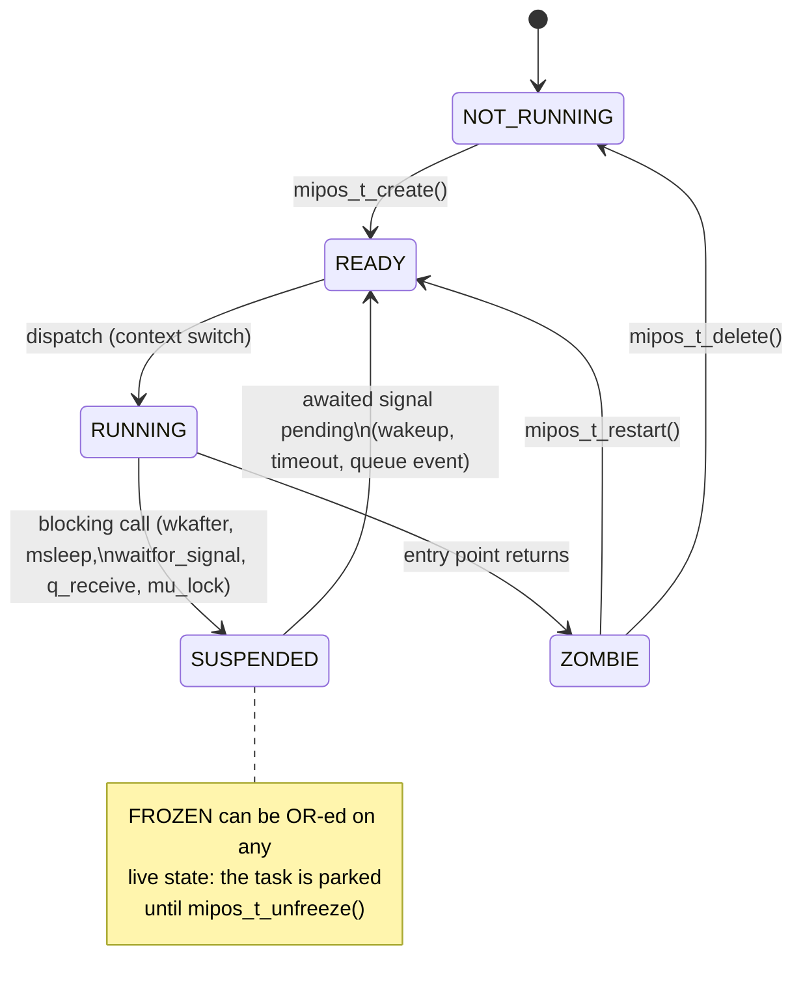
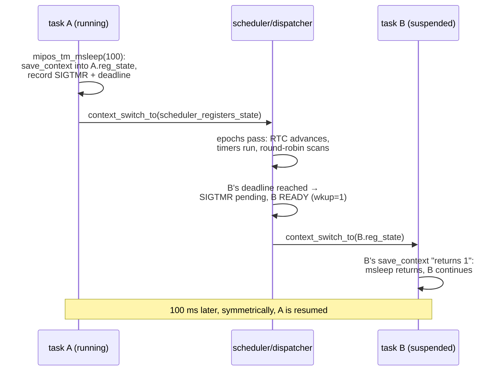

# mipOS Internals — Anatomy of a Cooperative Multitasking Kernel

> This document is the modern successor of the article *“Realizzare un sistema
> multitasking in C”* (Computer Programming n. 149, September 2005, also
> included in this repository as [`mipos/art_cp149.pdf`](../mipos/art_cp149.pdf)),
> which described the embryonic system that later became **mipOS**. It has been
> rewritten and extended from scratch against the current source tree
> (mipOS 2.1): every structure, state, and function name below matches the
> code as it is today.
>
> The cut is deliberately **didactic**: beyond describing *what* the kernel
> does, it explains *why* a kernel — even one this small — changes the way
> firmware is written, and why each design decision was made. mipOS is small
> enough to be read in an afternoon and complete enough to teach the concepts
> that industrial RTOSes are built on; this document is meant to be the
> guided tour.

## Table of contents

1. [Why an operating system improves firmware](#1-why-an-operating-system-improves-firmware)
2. [Motivation and design goals](#2-motivation-and-design-goals)
3. [System overview](#3-system-overview)
4. [The kernel environment](#4-the-kernel-environment)
5. [Tasks and the task descriptor](#5-tasks-and-the-task-descriptor)
6. [Task states and lifecycle](#6-task-states-and-lifecycle)
7. [The scheduler](#7-the-scheduler)
8. [Signals](#8-signals)
9. [The dispatcher and the context switch](#9-the-dispatcher-and-the-context-switch)
10. [Time: ticks, RTC and software timers](#10-time-ticks-rtc-and-software-timers)
11. [Synchronization objects](#11-synchronization-objects)
12. [System call reference](#12-system-call-reference)
13. [Optional modules](#13-optional-modules)
14. [The porting layer (BSP)](#14-the-porting-layer-bsp)
15. [Interrupts and critical sections](#15-interrupts-and-critical-sections)
16. [A complete example: producer/consumer](#16-a-complete-example-producerconsumer)
17. [Application patterns](#17-application-patterns)
18. [Configuration and memory footprint](#18-configuration-and-memory-footprint)
19. [Suggested exercises](#19-suggested-exercises)
20. [From 2005 to today: what changed](#20-from-2005-to-today-what-changed)

---

## 1. Why an operating system improves firmware

Before opening the kernel, it is worth spending a few pages on the question
that justifies its existence: *what does an OS buy you on a chip with a few
KB of RAM?* The answer is not “performance” — a superloop is faster — and not
“features”. The answer is **structure**: an OS changes the *shape* of the
code you write, and that shape is what determines whether firmware stays
maintainable as it grows.

### 1.1 The bare-metal superloop

The canonical no-OS firmware is a *superloop*: one infinite loop that polls
everything, plus a set of hand-written state machines that remember where
each activity was. Take a deliberately ordinary example — a device that must
(a) blink a status LED every 500 ms, (b) debounce a button and toggle a relay
on press, and (c) answer commands arriving on a serial port:

```c
/* --- bare-metal superloop: no OS ------------------------------------- */

enum led_state    { LED_ON, LED_OFF };
enum btn_state    { BTN_IDLE, BTN_DEBOUNCING, BTN_PRESSED };
enum uart_state   { RX_WAIT_START, RX_IN_FRAME, RX_EXECUTING };

int main(void)
{
    enum led_state  led  = LED_OFF;  uint32_t led_deadline  = 0;
    enum btn_state  btn  = BTN_IDLE; uint32_t btn_deadline  = 0;
    enum uart_state rx   = RX_WAIT_START;
    char frame[32]; int frame_len = 0;

    hw_init();

    for (;;) {
        uint32_t now = hw_millis();

        /* -- LED blinker ---------------------------------------------- */
        if (now >= led_deadline) {
            led = (led == LED_OFF) ? LED_ON : LED_OFF;
            hw_led(led == LED_ON);
            led_deadline = now + 500;
        }

        /* -- button debouncer ------------------------------------------ */
        switch (btn) {
            case BTN_IDLE:
                if (hw_button_down()) { btn = BTN_DEBOUNCING;
                                        btn_deadline = now + 20; }
                break;
            case BTN_DEBOUNCING:
                if (now >= btn_deadline) {
                    btn = hw_button_down() ? BTN_PRESSED : BTN_IDLE;
                    if (btn == BTN_PRESSED) hw_relay_toggle();
                }
                break;
            case BTN_PRESSED:
                if (!hw_button_down()) btn = BTN_IDLE;
                break;
        }

        /* -- serial protocol ------------------------------------------- */
        int c = hw_uart_poll();
        if (c >= 0) {
            switch (rx) {
                case RX_WAIT_START:
                    if (c == ':') { rx = RX_IN_FRAME; frame_len = 0; }
                    break;
                case RX_IN_FRAME:
                    if (c == '\r') { execute_command(frame, frame_len);
                                     rx = RX_WAIT_START; }
                    else if (frame_len < 32) frame[frame_len++] = c;
                    break;
                /* ... */
            }
        }
    }
}
```

This works, ships in millions of devices, and is the right answer for tiny
programs. But look closely at what the code has become.

### 1.2 What is actually wrong with it

**The control flow is inverted.** Each activity is naturally sequential —
*“wait 20 ms, then re-read the pin”* — but the superloop cannot wait, so
every activity is turned inside out into a state machine: the *position in
the algorithm* becomes an `enum` plus a deadline variable, updated a fragment
at a time. The programmer simulates by hand what a call stack would remember
for free. Computer scientists call this *stack ripping*: the logical thread
of control is ripped into fragments, and its state is scattered into
explicit variables.

**State multiplies, and states couple.** Three activities × a handful of
states each is manageable. Ten activities, some of which interact (the
command handler must not toggle the relay while the debouncer is mid-flight…)
and the cross-product starts leaking into guard conditions all over the
loop. Every new feature must be threaded through the *same* loop, touching
code it has nothing to do with.

**Infrastructure and domain logic melt together.** In the snippet above,
which lines are *business logic* (toggle the relay on a press, execute a
frame) and which are *plumbing* (deadlines, debounce timing, frame
reassembly, the loop itself)? They are interleaved statement by statement.
The 2005 article called this out precisely: *“non di rado la parte
infrastrutturale si confonde con il dominio del campo di applicazione”* —
the infrastructure blends into the problem domain. Nothing in that loop can
be lifted out and reused in the next project without dragging the rest
along.

**Waiting is a global concern.** No fragment may take long, ever, or every
other activity starves. A CRC over a big buffer, a slow EEPROM write — each
must itself be chopped into yet another state machine. The discipline that
the loop imposes is invisible in any single function; it exists only as a
convention the whole file must obey.

**Testing is hard.** The unit of behavior — “the debounce algorithm” — has
no function to call. It exists as a diagonal slice through `main()`.

### 1.3 The same firmware, written on mipOS

Now the identical requirements as three mipOS tasks:

```c
/* --- the same firmware on mipOS -------------------------------------- */

static int led_task(task_param_t p)
{
    (void)p;
    for (;;) {
        hw_led(1); mipos_tm_msleep(500);
        hw_led(0); mipos_tm_msleep(500);
    }
    return 0;
}

static int button_task(task_param_t p)
{
    (void)p;
    for (;;) {
        while (!hw_button_down()) mipos_schedule();  /* wait for press   */
        mipos_tm_msleep(20);                         /* debounce window  */
        if (hw_button_down()) {
            hw_relay_toggle();
            while (hw_button_down()) mipos_schedule(); /* wait release   */
        }
    }
    return 0;
}

static int uart_task(task_param_t p)
{
    char frame[32];
    (void)p;
    for (;;) {
        int len = 0;
        while (uart_getc() != ':') { }        /* wait for frame start    */
        for (;;) {
            char c = uart_getc();             /* uart_getc blocks nicely */
            if (c == '\r') break;
            if (len < 32) frame[len++] = c;
        }
        execute_command(frame, len);          /* pure domain logic       */
    }
    return 0;
}
```

Each task reads exactly like its specification: *blink; wait; debounce;
wait; reassemble a frame; execute it.* The state machines are gone — or
rather, they are still there, but the **call stack encodes them**: “we are
halfway through the debounce window” is no longer an enum value; it is the
program counter and stack of `button_task`, frozen inside the kernel while
the task sleeps. The `enum` + deadline pairs of §1.1 were a manual,
error-prone re-implementation of what a stack does natively.

Just as important: the three activities now know nothing about each other.
`led_task` can be deleted, `uart_task` can be lifted into the next product
unchanged, and a fourth task can be added without touching any of them.
The infrastructure — who runs when, how waiting works — has moved into a
component (the kernel) that is *generic, testable in isolation, and reused
across every application*. That is the separation between problem domain
and reusable abstraction that the superloop structurally cannot offer.

### 1.4 What a blocking function really is

The transformation above hinges on one linguistic device: the **blocking
call**. It deserves a precise definition, because it is the single most
important abstraction an OS gives to firmware.

A blocking function — `mipos_tm_msleep()`, `mipos_q_receive()`,
`mipos_mu_lock()` — is a function whose *semantics* are “return when the
condition holds” and whose *mechanics* are:

1. record what the caller is waiting for (a signal mask, a deadline);
2. photograph the CPU state — registers, stack pointer, program counter —
   into the task descriptor (`mipos_save_context`, §9);
3. jump to the scheduler, which runs *other* tasks;
4. when the condition holds, restore the photograph: the function “returns”
   as if nothing had happened, on the same stack, with all locals intact.

In other words, a blocking call **reifies the continuation** of the caller:
“the rest of this function” becomes a storable, resumable value. Languages
acquired `async/await` decades later to express the same idea; a cooperative
kernel in C gives it to you with two library calls and a saved stack
pointer. Once waiting is expressible *in* the language of the program —
rather than encoded around it — sequential reasoning is restored, and
sequential reasoning is what humans are good at.

There is a second, subtler gift. In a **cooperative** kernel, a context
switch can happen *only* inside a blocking call. Between two blocking calls,
a task is effectively atomic with respect to all other tasks: no locks are
needed to protect data shared *among tasks* as long as updates do not
straddle a yield. Compare that with preemptive multithreading, where every
shared access is suspect. Cooperative multitasking keeps most of the
simplicity of the superloop’s single-threaded memory model while removing
its structural damage. (Interrupts remain the one asynchronous agent —
§15.)

### 1.5 The honest price list

Structure is not free, and a didactic text should say so:

- **One stack per task.** Stacks are the dominant RAM cost of a threaded
  design (§18 discusses sizing). The superloop shares a single stack.
  This is why mipOS lets the *application* own stack memory: on a 2 KB
  part you will make different choices than on a 64 KB one — and why the
  `MIPOS_RT` polled-task escape hatch exists (§7) for activities too small
  to deserve a stack.
- **Cooperation is a discipline.** A task that computes for 100 ms without
  yielding stalls every other task; the kernel cannot help (there is no
  preemption by design). The discipline is the same one the superloop
  demanded — “no fragment may take long” — but at least it is now *local*:
  a long computation just needs a `mipos_schedule()` sprinkled inside it,
  not a rewrite into a state machine.
- **Latency is bounded by the least cooperative task**, and by scheduler
  epoch granularity (§10). mipOS offers soft real time, not hard
  guarantees; anything with microsecond deadlines belongs in an ISR.
- **A kernel is code**: a few KB of flash, a few hundred bytes of RAM for
  its tables. *Multum in parvo* is precisely the claim that this price is
  small — §18 quantifies it.

With the “why” established, everything that follows is the “how”.

## 2. Motivation and design goals

Microcontrollers with a few KB of RAM are still, twenty years after the
original article, programmed as described in §1.1. Full-featured RTOSes
solve the structural problem but assume resources (RAM, flash, per-task
kernel structures, sometimes an MMU/MPU) that small parts do not have.

mipOS (*Multum In Parvo* Operating System) sits deliberately in between. Its
goals, unchanged since 2005:

- a **cooperative, event-driven multitasking kernel**: the running task
  voluntarily yields to the system; the kernel never preempts;
- a **complete API** for task management and synchronization (signals,
  mutexes, message queues, software timers);
- **portability**: the kernel is plain C; each port isolates the few
  architecture-specific primitives (stack switching, context save/restore,
  interrupt masking) in a small BSP;
- **host simulation as a first-class target**: the same kernel runs as a
  user-space process on Windows, Linux, and macOS. Pedagogically this is
  gold — you can single-step the dispatcher in a desktop debugger — and
  practically it means application logic is developed and unit-tested off
  target;
- **no dynamic resource ownership in the kernel**: task stacks, queue pools,
  and memory-manager arenas are allocated by the user and lent to the
  kernel. The kernel owns only its own static tables. On a small part,
  *whoever owns memory owns the budget*: mipOS keeps the budget in the
  application’s hands, where the linker map can audit it.

What the kernel intentionally does *not* do: memory protection, device and
I/O management, preemption, per-task privilege. Those are either delegated
to the BSP or out of scope for the class of systems mipOS targets. Each
omission is a feature: it is what keeps the kernel readable end-to-end.

## 3. System overview

```text
┌───────────────────────────────────────────────────────────────┐
│                    Application tasks (user)                   │   domain
├────────────┬──────────────────────────────┬───────────────────┤ ──────────
│  Console   │  malloc / memory pools       │  stdio / tinyFS / │
│  (CLI)     │  (optional)                  │  vFAT (optional)  │  reusable
├────────────┴──────────────────────────────┴───────────────────┤  platform
│  KERNEL: tasks · scheduler/dispatcher · signals · mutex ·     │
│          queues · software timers                             │
├───────────────────────────────────────────────────────────────┤
│  BSP / arch port: context switch · stack switch · critical    │
│  sections · RTC tick source · serial console I/O              │
├───────────────────────────────────────────────────────────────┤
│  Bare metal (STM8/STM32/Cortex-M/QEMU) or host process (simu) │
└───────────────────────────────────────────────────────────────┘
```

The dashed line at the top is the whole point of the architecture: it is the
boundary between *your problem* and *everybody’s plumbing*. Everything below
it is generic and travels unchanged from project to project; everything
above it is domain code written in terms of tasks and blocking calls. The
console module is a good example of the leverage this buys: because it is
written against the kernel API and the two BSP serial functions, the same
CLI — `ps`, `dump`, `freeze`, user commands — runs identically inside a
Windows process and on a bare-metal Cortex-M3, and costs an application
exactly one `mipos_console_init()` call.

The source layout mirrors the picture:

| Directory / file | Role |
|---|---|
| `mipos/mipos_kernel.{h,c}` | scheduler, dispatcher, signals, RTC, software timer engine |
| `mipos/mipos_task.c` | task creation/deletion/status |
| `mipos/mipos_timer.{h,c}` | software timer API |
| `mipos/mipos_queue.{h,c}`, `mipos/mipos_mutex.h` | synchronization objects |
| `mipos/mipos_malloc.{h,c}`, `mipos/mipos_mpool.{h,c}` | optional memory managers |
| `mipos/mipos_console.{h,c}`, `mipos/mipos_tfs.{h,c}`, `mipos/mipos_stdio.{h,c}` | optional CLI, tiny filesystem, stdio |
| `mipos/arch/simu/` | host simulator port (x86/x64/AArch64; MSVC and GCC/Clang) |
| `mipos/arch/qemu-arm/` | bare-metal ARM Cortex-M3 port for QEMU (`lm3s6965evb`) |
| `mipos/arch/stm32/`, `mipos/arch/ctxm3/` | STM32 / Cortex-M3 port (IAR toolchain) |
| `mipos/arch/stm8/` | STM8/ST7 port (Cosmic, Raisonance) |

Everything above the BSP line is identical across ports.

## 4. The kernel environment

The whole kernel state lives in one statically allocated structure,
`mipos_kernel_env` (type `mipos_kernel_t`, defined in `mipos_types.h`):

```c
typedef struct __kernel_t
{
    unsigned long tick_counter;        // incremented at every TSM iteration

    idle_state_notify_cbk_t idle_state_notify_cbk;  // optional idle hook
    task_param_t idle_param;

    mipos_rtc_cntr_t rtc_counter;      // wall-clock quanta (typically 1 ms)

    mipos_task_id_t current_task;      // TID of the task being scheduled
    mipos_task_t* task_context_ptr;    // shortcut to its descriptor

    int task_count;

    registers_state_t scheduler_registers_state;  // scheduler's own context

    mipos_task_t task_table[MIPOS_TASKS_TBL_ENTRIES_CNT];  // task descriptors

    mipos_rtc_cntr_t next_rtc_timeout; // earliest soft-timer deadline
    mipos_timer_bmp_t timer_bitmap;    // active-timer bitmap
    mipos_timer_t timer_table[MIPOS_MAX_TIMERS_NO];
} mipos_kernel_t;
```

Why a single static structure, rather than dynamically created objects?

- **Determinism**: RAM usage is a compile-time constant, visible in the map
  file. `mipos_t_create` cannot fail for lack of heap — only for lack of a
  free table slot, which is a design-review decision, not a runtime
  surprise.
- **Inspectability**: one watch expression in a debugger (or one `dump` on
  the console) shows the entire OS state. The console `ps` command is
  little more than a pretty-printer over `task_table`.
- **No init order problems**: BSS is the constructor.

Two clocks coexist and the distinction matters:

- **`tick_counter`** counts *scheduler iterations*. It advances as fast as
  the scheduler loop spins and has no relation to wall-clock time. It drives
  `mipos_tm_wkafter(n)` — “give the CPU away for *n* scheduler rounds”. Use
  it to *interleave* with other tasks (fairness), not to *measure time*.
- **`rtc_counter`** counts *real-time quanta* (1 ms on every current port).
  The BSP feeds it — see §10. It drives `mipos_tm_msleep()` /
  `mipos_tm_usleep()` and the software timers. Use it whenever the
  specification says “milliseconds”.

A common beginner bug is using `mipos_tm_wkafter(500)` to mean “500 ms”: on
a fast CPU with few tasks the scheduler may complete 500 epochs in a few
hundred microseconds. The two-clock design makes the two meanings of “wait”
explicit in the API.

## 5. Tasks and the task descriptor

A *task* is a sequential activity with a private stack, sharing the address
space with every other task. Inside the kernel each task is represented by a
**task descriptor** (TD), `mipos_task_t`:

```c
typedef struct __task_t
{
    mipos_task_name_t name;            // task name (points to user memory)
    task_entry_point_t entry_point;    // int (*)(task_param_t)
    int task_ret_value;                // value returned by a terminating task
    task_param_t param;                // user context cookie

    task_status_t status;              // READY, RUNNING, ...

    union {                            // special-purpose flags
        task_flag_t flags;             // .wkup (resume pending), .rt_task
        task_flag_mask_t i_flags;
    } u_flags;

    mipos_task_tickcntr_t timer_tick_count; // used by mipos_tm_wkafter
    mipos_rtc_cntr_t rtc_timeout;           // used by mipos_tm_msleep/usleep

    mipos_task_sigmask_t signal_mask;       // signals the task accepts
    mipos_task_sigmask_t signal_pending;    // signals delivered, not consumed
    mipos_task_sigmask_t signal_waiting;    // signals the task is blocked on

    registers_state_t reg_state;            // saved CPU context (jmp_buf)
    mipos_reg_t kernel_stack_pointer;       // scheduler SP, saved at dispatch
    mipos_reg_t process_stack_pointer;      // task SP, saved at suspension

    char* task_stack;                       // user-provided stack area
    mipos_task_stack_size_t stack_size;
} mipos_task_t;
```

Reading the TD is reading the thesis of §1.4 in data-structure form: a task
*is* its continuation. `reg_state` + `process_stack_pointer` + the stack
memory they point into are the frozen “rest of the function”; everything
else is metadata about *when* to thaw it (`signal_*`, `timer_tick_count`,
`rtc_timeout`) and bookkeeping (`name`, `status`, `param`).

Operational details worth knowing:

- **The TD table is fixed at compile time** (`MIPOS_TASKS_TBL_ENTRIES_CNT` =
  `MIPOS_MAX_TASKS_COUNT + 1`, see `mipos_limits.h`). The table index *is*
  the task identifier (TID) — no hashing, no handles, O(1) lookup, and a
  TID that fits any integer type.
- **Entry 0 is the idle task**, created by the kernel itself. It runs when
  no other task is schedulable and invokes the optional user idle callback
  (`mipos_set_idle_cbk()`) — the natural place for a `WFI` instruction or a
  power-down hook on real hardware.
- **The root task has TID 1** and is created by `mipos_start()`, the kernel
  entry point (the article’s `jmp_to_kernel`). The root task is ordinary in
  every respect; by convention it creates the others and then either
  becomes one of the workers or deletes itself (`mipos_t_delete(0)`).
- **Stacks are user memory.** `mipos_t_create()` receives a pointer and a
  size; the kernel never allocates. The dispatcher will point the CPU stack
  register at the *top* of that area (stacks grow downward on all supported
  targets), aligning it down to 16 bytes on 64-bit simulator targets as the
  x86-64 and AArch64 ABIs require.
- **A TD is free when `entry_point` is null**; `mipos_t_create()` scans the
  table from index 1 and claims the first free slot inside a critical
  section.
- `param` is the idiomatic way to reuse one entry-point function for several
  task instances (see the workers in the scheduler smoke test, which share
  `worker_task` and receive their identity as `param`).

## 6. Task states and lifecycle

The status field is a bitmask. Compared with the 2005 design, one state was
added (`FROZEN`) and the encoding became explicit:

| State | Value | Meaning |
|---|---|---|
| `TASK_NOT_RUNNING` | 1 | TD unused / task deleted; slot reusable |
| `TASK_READY` | 2 | eligible for dispatch |
| `TASK_RUNNING` | 4 | currently owning the CPU |
| `TASK_SUSPENDED` | 8 | blocked, waiting for one or more signals |
| `TASK_ZOMBIE` | 16 | entry point returned; TD retained until deleted or restarted |
| `TASK_FROZEN` | 32 | flag OR-ed onto the state: the scheduler skips the task until unfrozen |



It is instructive to pin each edge to the exact line of code that performs
it — the whole machine is only a few dozen lines of `mipos_kernel.c`:

- `NOT_RUNNING → READY`: `_mipos_t_create` (macro) fills the TD and writes
  `TASK_READY`.
- `READY → RUNNING`: the TSM `case TASK_READY` marks the task `RUNNING` and
  falls into the dispatcher.
- `RUNNING → SUSPENDED`: not performed by the scheduler at all — the *task
  itself* does it inside the blocking primitive
  (`_mipos_t_set_wait_for_signal` sets `signal_waiting` and the status)
  before jumping back to the scheduler. In a cooperative kernel, blocking
  is always first-person.
- `SUSPENDED → READY`: the TSM `case TASK_SUSPENDED` evaluates the wakeup
  conditions (§8) and, on a match, sets `wkup = 1` and `TASK_READY`.
- `RUNNING → ZOMBIE`: when an entry point returns, the dispatcher regains
  control (§9); on the *next* visit the TSM finds the task still marked
  `RUNNING` — which at that point can only mean “returned” — and retires it
  to `ZOMBIE`.
- `ZOMBIE → READY / NOT_RUNNING`: user policy, via `mipos_t_restart[_with_param]`
  or `mipos_t_delete`. The kernel never deletes a task on its own: whether
  a finished activity should be reaped, restarted, or kept for post-mortem
  inspection (`ps` shows zombies) is a domain decision, so it belongs above
  the API line.

`FROZEN` is deliberately a *flag*, not a state: freezing must compose with
whatever the task was doing. A task frozen mid-sleep keeps its wakeup
bookkeeping; unfreezing resumes exactly where the state machine left off.
It exists mostly as an operator’s tool — the console exposes
`freeze`/`unfreeze` directly.

## 7. The scheduler

The scheduler is the loop inside `mipos_start()` (`mipos_kernel.c`). Each
iteration — an *epoch* — performs, in order:

1. `mipos_kick_watchdog()` — on hardware with a watchdog, the scheduler
   heartbeat is the natural place to service it;
2. `mipos_bsp_notify_scheduler_epoch()` — the hook the BSP uses to advance
   the RTC (§10);
3. the **software-timer engine** (§10): runs expired timer callbacks;
4. **task selection**, then the **TSM** (§6), then the **dispatcher** (§9).

Task selection is a **round-robin scan** of the TD table starting after
`current_task`:

- **RT tasks** (created with the `MIPOS_RT` flag) are *called directly by
  the scheduler*, inline, on the scheduler’s own stack, at every epoch in
  which they are encountered. They must be short and non-blocking —
  conceptually they are polled handlers, not threads. Their return value,
  if non-zero, is interpreted as a TID to promote to `READY` (a *deferred
  procedure call*: an RT task can wake a normal task).
- Descriptors that are empty, RT, `NOT_RUNNING`, `ZOMBIE`, or `FROZEN` are
  skipped.
- If a full sweep finds nothing schedulable, the **idle task** (entry 0)
  runs and the scan restarts.

Why do RT tasks exist at all, when ISRs and normal tasks already cover the
spectrum? Because there is a gap between them, and firmware lives in it:

| Mechanism | Runs | Stack | May block | Best for |
|---|---|---|---|---|
| ISR | on hardware event | shared/MSP | never | µs-latency reactions |
| **RT task** | every scheduler epoch | scheduler’s | never | fast polling, glue, waking workers |
| Normal task | when dispatched | private | yes | everything with sequential logic |

An RT task is a superloop fragment that *pays no stack* and needs no
interrupt: poll a FIFO flag, sample an input, and — through the DPC return
value or `mipos_t_notify_signal` — hand the real work to a task that can
afford to block. It is mipOS acknowledging that §1.1 got *one* thing right:
some activities really are three lines of polling.

**There are no priorities.** The 2005 prototype had a priority field with a
starvation-avoidance rule; mipOS dropped it (the STM32/IAR port still
carries a `MIPOS_IGNORE_TASK_PRIORITY` define as a fossil of the
transition). The reasoning is worth internalizing: in a *cooperative*
kernel, a priority only takes effect at yield points, so real latency is
governed by how often tasks yield, not by priority arithmetic — while the
cost of priorities (inversion, starvation rules, a harder scheduler to
reason about) is paid in full. Round-robin keeps the scheduler a dozen
lines and makes “when does my task run?” answerable by inspection. If an
activity truly cannot wait its turn, it belongs in an RT task or an ISR.

## 8. Signals

Signals are per-task event flags, deliberately reminiscent of POSIX but far
simpler: each is one bit of an 8-bit mask. They are the kernel’s *only*
wakeup mechanism — every blocking primitive, including sleeps and queue
receives, is “wait for a signal” under the hood. One mechanism, learned
once, explains the entire blocking API.

| Signal | Value | Reserved for |
|---|---|---|
| `MIPOS_SIGWKP` | 0x01 | `mipos_t_suspend()` / `mipos_t_resume()` |
| `MIPOS_SIGQUE` | 0x02 | blocking `mipos_q_receive()` |
| `MIPOS_SIGALM` | 0x04 | `mipos_tm_wkafter()` (tick-based delay) |
| `MIPOS_SIGTMR` | 0x08 | `mipos_tm_msleep()` / `mipos_tm_usleep()` (RTC-based) |
| `MIPOS_SIGUSR1..3` | 0x10..0x40 | user events (`mipos_t_waitfor_signal`) |

Three masks in the TD cooperate, and the separation is the design:

- `signal_mask` — which signals the task *accepts*
  (`mipos_t_sig_allow`/`mipos_t_sig_ignore`; the system signals cannot be
  masked). Filtering at delivery.
- `signal_pending` — which signals *have been delivered* and not yet
  consumed. This is what makes signals race-free in a cooperative world:
  if the event fires *before* the task gets around to waiting, the bit sits
  in `pending` and the subsequent wait returns immediately. No lost
  wakeups, no check-then-sleep window.
- `signal_waiting` — which signals the task is *currently blocked on*.

`mipos_t_notify_signal(tid, sig)` just ORs into `signal_pending` (filtered
by `signal_mask`) inside a critical section — safe from an RT task, cheap
enough for an ISR on ports where kernel structures are interrupt-protected.

The scheduler completes the picture while examining a `SUSPENDED` task:

- if the task waits on `MIPOS_SIGALM`, its `timer_tick_count` is
  decremented once per epoch; on reaching zero the signal is made pending —
  this is `mipos_tm_wkafter(n)`;
- if it waits on `MIPOS_SIGTMR`, the pending bit is set when
  `rtc_counter >= rtc_timeout` — this is `mipos_tm_msleep(ms)`;
- when `signal_pending & signal_waiting` is non-empty the task is woken:
  the matched bits are consumed and the task becomes `READY` with
  `wkup = 1`.

A worked trace makes the three masks concrete. Task B (a logger) waits for
data with `mipos_t_waitfor_signal(MIPOS_SIGUSR1)`; task A produces a record
and calls `mipos_t_notify_signal(b_tid, MIPOS_SIGUSR1)`:

1. B’s primitive sets `signal_waiting |= SIGUSR1`, saves B’s context, marks
   B `SUSPENDED`, jumps to the scheduler.
2. A (later, any epoch) ORs `SIGUSR1` into B’s `signal_pending`. A did not
   yield: nothing else happens yet.
3. Next time the scheduler’s round-robin reaches B: `pending & waiting`
   is non-zero → consume the bit, `status = READY`, `wkup = 1`.
4. The dispatcher restores B’s context; B’s `waitfor_signal` “returns”, and
   B resumes after it.

Had A fired the signal *before* step 1, step 3 would simply have succeeded
at B’s first suspension check — the pending bit was parked. Sequence never
matters; that is the property that makes signal-based code composable.

## 9. The dispatcher and the context switch

The mechanism is the one the 2005 article introduced — and it remains the
heart of the system: **`setjmp`/`longjmp` as a portable context switch**,
plus a few lines of architecture-specific code to switch stacks.

A *suspension* (every blocking primitive expands to a variant of this, see
`_mipos_tm_wkafter` in `mipos_kernel.h`) looks like:

```c
if (mipos_save_context(task->reg_state)) {
    /* longjmp landed here: we are being resumed */
    _mipos_t_reset_signal_and_run(SIGNUM);
} else {
    task->process_stack_pointer = mipos_get_sp();
    _mipos_t_set_wait_for_signal(SIGNUM);
    mipos_context_switch_to(kernel_env.scheduler_registers_state);
}
```

`mipos_save_context` photographs the CPU state (callee-saved registers,
stack pointer, program counter) into the TD and returns 0;
`mipos_context_switch_to` restores a previously saved state, causing the
corresponding `mipos_save_context` to “return again”, this time non-zero.
The `if` therefore reads: *“took the photo”* (else-branch: go to sleep) vs
*“woke up from the photo”* (then-branch: clean up and continue). Whether
these are literally `setjmp`/`longjmp` or a hand-written equivalent is a
per-port decision (§14).

The **dispatcher** (tail of `mipos_start()`) saves the *scheduler’s* context
the same way, then distinguishes two cases:

1. **Resuming a suspended task** (`wkup == 1`): a single
   `mipos_context_switch_to(task->reg_state)` — stack pointer included in
   the restored state — continues the task right after its
   `mipos_save_context`.
2. **First execution of a READY task**: there is no photograph yet, so the
   dispatcher must move execution onto the task’s own stack before calling
   the entry point. On 32-bit ports this is the classic pair from the
   article (renamed):

   ```c
   mipos_replace_sp(&task->kernel_stack_pointer, top_of_the_stack);
   task->task_ret_value = task->entry_point(task->param);
   /* entry point returned: back to the kernel stack */
   mipos_set_sp(&task->kernel_stack_pointer);
   ```

   On 64-bit simulator targets the same sequence is packaged in a dedicated
   assembly primitive, `mipos_start_task_on_stack(old_sp, new_sp, entry,
   param)` (MASM `mipos_start_task64` on Windows, `mipos_start_task_gnu` in
   `bsp_gnu.S` for GCC/Clang), which also honors the ABI details a macro
   cannot: 16-byte stack alignment, the Windows x64 32-byte shadow space,
   and the AAPCS64 frame on ARM64.

A complete yield/resume cycle, end to end:



Notice what is *absent*: no interrupt, no trap, no privileged instruction.
The entire context switch is function calls and one stack-pointer move —
which is why the same kernel runs unmodified inside a desktop process. The
educational corollary: you can put a breakpoint on `mipos_save_context`,
watch `reg_state` fill, and *see* a continuation being captured.

When the entry point returns, the dispatcher restores the kernel stack and
jumps back to the scheduler, which will find the task still `RUNNING` and
retire it to `ZOMBIE` — the task-termination path of §6.

Two subtleties worth recording:

- On Windows x64 the MSVC `setjmp` cannot be used for stack-hopping (it
  drags in unwinding machinery), so the port implements
  `mipos_save_context64`/`mipos_context_switch64` in MASM. Since the
  Windows x64 ABI marks XMM6–XMM15 and MxCsr callee-saved, those are saved
  and restored too — omitting them silently corrupts floating-point state
  across yields.
- On GCC/Clang targets (Linux, macOS, bare-metal ARM) the C library
  `setjmp`/`longjmp` are used directly: they save exactly the callee-saved
  set, which is all a *voluntary* (call-boundary) switch needs — the
  caller-saved registers are, by definition, already dead at a call. This
  is also why a cooperative switch is cheaper than a preemptive one, which
  must save *everything* because it can strike between any two
  instructions.

## 10. Time: ticks, RTC and software timers

`mipos_update_rtc(quantum)` is the single entry point through which real
time enters the kernel: it adds `quantum` (milliseconds, by convention) to
`rtc_counter`. Who calls it is a port decision:

- the **host simulator** computes the elapsed time inside
  `mipos_bsp_notify_scheduler_epoch()` from `GetTickCount64()` /
  `gettimeofday()` / `mach_absolute_time()`;
- the **QEMU ARM port** counts SysTick interrupts in the ISR and drains the
  count into `mipos_update_rtc()` from the same epoch hook, so kernel
  structures are only touched from thread context;
- a classic MCU port may call `mipos_update_rtc(1)` straight from a 1 ms
  timer ISR, provided ISRs and kernel share the interrupt-masking critical
  sections (§15).

On top of the RTC sits the **software timer engine** (`mipos_timer.h`), a
feature that did not exist in 2005:

```c
timer_id_t mipos_timer_start(on_expire, on_cancel, interval_ms, context, periodic);
int        mipos_timer_cancel(id);    // deferred: on_cancel runs in the scheduler
int        mipos_timer_restart(id, new_interval /* 0 = keep */);
int        mipos_timer_delete(id);    // immediate removal
```

Timers live in a fixed table (`MIPOS_MAX_TIMERS_NO`, default 4) with an
active-set bitmap. The scheduler evaluates them once per epoch, but only
when `next_rtc_timeout` — a cached earliest deadline — has been reached, so
the steady-state cost is one 64-bit comparison per epoch. Callbacks execute
on the scheduler stack and must observe the same rules as RT tasks: short,
non-blocking. A timer callback that must do real work should wake a task
(signal or queue) and return.

When should firmware use a timer instead of a sleeping task? The rule of
thumb: a **task** models an activity with its own control flow (“do A, wait,
do B”); a **timer** models a *reaction* attached to a deadline (“if no frame
arrives within 200 ms, flag a protocol error”). Timeouts guarding I/O are
the classic timer use case — cancel the timer on success, let its expiry
handler signal the error path otherwise.

**Accuracy caveat** (inherent to the design): both delays and timers are
*checked* by the scheduler loop, so their resolution is bounded below by
the longest interval between two yields anywhere in the system. If a task
computes for 30 ms without yielding, every deadline in the system can be
late by 30 ms. A cooperative kernel is only as responsive as its least
cooperative task — the discipline of §1.5 in quantitative form.

## 11. Synchronization objects

### Mutex (`mipos_mutex.h`)

```c
static mipos_mtx_t m = MU_INIT;
mipos_mu_lock(&m);      // spins with mipos_tm_wkafter(0) until free
...
mipos_mu_unlock(&m);
```

The mutex is a single state byte. `mipos_mu_lock` is a *cooperative spin*:
while locked it yields to the scheduler and retries on resumption — simple,
fair enough in practice, and free of wait queues. There is no ownership
tracking, no recursion, and — priorities not existing — no priority
inversion to worry about. Not callable from RT tasks (it can block).

Before reaching for it, recall §1.4: **between two blocking calls a task is
atomic with respect to other tasks**. A shared counter updated in three
statements needs no mutex if no yield sits between them. The mutex earns
its keep only when a *logical transaction spans blocking calls* — e.g. the
producer/consumer example of §16 uses mutexes not to protect data at all,
but as completion flags: “locked” means “I am still running”, and the root
task joins on its workers by locking their mutexes. That is the cooperative
idiom for `pthread_join`.

### Message queues (`mipos_queue.h`)

A FIFO of `mipos_q_item_t` (a machine word) over a user-provided pool:

```c
static mipos_queue_t q;
static mipos_q_item_t pool[16];
mipos_q_init(&q, pool, 16);

mipos_q_send(&q, value);              // never blocks; fails when full
mipos_q_receive(&q, &item, TRUE);     // TRUE: suspend on MIPOS_SIGQUE if empty
mipos_q_count(&q); mipos_q_message_pending(&q);
```

A blocking receiver records its TID in the queue (`suspended_tid`) and waits
on `MIPOS_SIGQUE`; `mipos_q_send` notifies that signal, waking the consumer.
From RT tasks use the non-blocking form (`bl = FALSE`).

The queue is the workhorse of task decoupling: the sender does not know who
consumes, the receiver’s code is a clean `for(;;){ receive; process; }`
loop, and the pool bounds memory by construction. Items are machine words —
when payloads are bigger, the idiom is to enqueue *pointers* to blocks
drawn from a memory pool (§13): allocator and queue compose into a
zero-copy mailbox.

## 12. System call reference

The updated version of the article’s *Tabella 1* — names as in
`mipos_kernel.h` today:

| Syscall | Object | Blocking | Description |
|---|---|---|---|
| `mipos_start` | kernel | — | starts the kernel and the root task (TID 1); never returns |
| `mipos_t_create` | task | no | creates a task (`MIPOS_NO_RT` or `MIPOS_RT`); returns its TID |
| `mipos_t_delete` | task | no | deletes a task; `0` = calling task |
| `mipos_t_suspend` | task | yes | suspends the caller until `mipos_t_resume` |
| `mipos_t_resume` | task | no | wakes a task suspended with `mipos_t_suspend` (sends `MIPOS_SIGWKP`) |
| `mipos_t_waitfor_signal` | task | yes | suspends the caller until one of the given `MIPOS_SIGUSRx` arrives |
| `mipos_t_notify_signal` | task | no | delivers signal(s) to a task |
| `mipos_t_sig_allow` / `mipos_t_sig_ignore` | task | no | edits a task’s signal mask (user signals only) |
| `mipos_t_restart[_with_param]` | task | no | re-arms a `ZOMBIE` task |
| `mipos_t_freeze` / `mipos_t_unfreeze` | task | no | parks / unparks a task |
| `mipos_t_get_status` | task | no | returns the task state |
| `mipos_tm_wkafter(n)` | time | yes | yields for *n* scheduler ticks; `0` = plain yield (`mipos_schedule()`) |
| `mipos_tm_msleep` / `mipos_tm_usleep` | time | yes | RTC-based sleep |
| `mipos_get_rtc_counter` | time | no | reads the RTC counter |
| `mipos_update_rtc` | time | no (ISR) | advances the RTC; called by the BSP |
| `mipos_timer_start/cancel/restart/delete` | timer | no | software timers (§10) |
| `mipos_mu_init/lock/unlock` | mutex | lock: yes | cooperative mutex |
| `mipos_q_init/send/receive/count/message_pending` | queue | receive: opt. | FIFO message queue |
| `mipos_set_idle_cbk` | kernel | no | registers the idle-state callback |

“Blocking” calls must not be used inside RT tasks or timer callbacks.

## 13. Optional modules

Each module is enabled by a compile-time switch and costs nothing when off.
Beyond their individual utility, the modules are the *proof* of §1.3’s
reuse claim: all of them are written purely against the kernel API and the
BSP contract, which is why each runs bit-identically on Windows, Linux,
macOS, and a bare-metal Cortex-M3.

| Module | Switch | Summary |
|---|---|---|
| **Console** | `ENABLE_MIPOS_CONSOLE` | interactive CLI on the BSP serial port: two system tasks (`cnslrx`, `cnsltx`) implement echo, line editing and a command table. Built-ins: `help`, `ver`, `ps`, `dump`, `patch`, `freeze`, `unfreeze`, `delete`, `signal` (+ `ls`, `cat` with the filesystem). User commands are registered with `mipos_console_register_cmd_list()`. Pedagogically it is also a worked example of the queue+signal patterns of §11: RX polls the UART and parses; TX drains a message queue. |
| **Memory manager** | `ENABLE_MIPOS_MALLOC` | list-based allocator over a user arena (`mipos_mm_*`): first-fit with block splitting, 4-byte alignment, and on-demand free-list compaction as a second chance when allocation fails; plus a global `mipos_malloc/calloc/realloc/free` facade bound with `mipos_set_malloc_mm()`. |
| **Memory pools** | `ENABLE_MIPOS_MPOOL` | O(1) fixed-size block allocator (`mipos_mpool_*`) — the deterministic option for hot paths, and the natural companion of queues (§11). |
| **Tiny FS** | `ENABLE_MIPOS_FS` | `tinyFS`: a minimal cluster-based filesystem (32-byte clusters, 8 files max by default) over a user-supplied block device (`mipos_io_dev_t` read/write callbacks) — RAM disk, EEPROM, flash. |
| **stdio** | `ENABLE_MIPOS_STDIO` | `mipos_fopen/fread/fwrite/fseek/...` layered on tinyFS. |
| **FatFS glue** | — | `mipos_diskio.c` adapts the kernel to ChaN’s FatFS (vFAT) as an alternative filesystem; see the `fatfs` simulator example. |

### 13.1 Optional networking

The TCP/IP stack is optional and selected at build time with
`-DMIPOS_NET_STACK=lwip`. The current port uses lwIP in `NO_SYS=1` mode and
keeps the integration on raw lwIP APIs: Ethernet/IPv4, ARP, ICMP, UDP, TCP,
DHCP client, DNS client, and a mipOS-facing `netif` adapter in
`mipos/net/lwip/`. IPv6, sockets, and netconn are not enabled.

The adapter boundary is intentionally simple:

| Layer | Responsibility |
|---|---|
| `mipos_lwip_netif_open` | creates an lwIP Ethernet `netif`, assigns MAC/IP/netmask/gateway, and installs a link-output callback |
| example backend | injects received Ethernet frames into lwIP and transmits frames produced by lwIP |
| `mipos_lwip_netif_poll` | drives lwIP timers with `sys_check_timeouts()`, which is required by TCP, DHCP, and DNS |
| tests | validate ARP, ICMP, UDP, TCP, DHCP discover, and DNS query generation using an in-memory link, without host network privileges |

The host-network examples support Windows and Linux. On Windows,
`example-net-pcap` loads `wpcap.dll` dynamically and is useful for adapter
listing and packet capture/injection through Npcap; `example-net-tap` opens a
TAP-Windows device directly and marks the virtual link connected. On Linux,
`example-net-tap` opens `/dev/net/tun` directly against a kernel TAP interface
created by `scripts/run-net-pcap.sh`. The pcap backend still links against
libpcap and is useful for adapter listing, capture, and experiments, but the
direct TAP backend is the normal Linux path when the host kernel must answer
mipOS ARP requests. The interactive `mipOS-net>` console is available from the
direct TAP backends; packet logs are disabled by default and can be toggled
with `verbose` and `quiet`. On Linux the console runs a small raw-mode line
editor for Backspace, Delete, Ctrl-C, Ctrl-D, and Up/Down history while
restoring the terminal state on exit.

The normal TAP topology is:

```text
mipOS 10.77.0.2/24
  gateway 10.77.0.1
        |
TAP-Windows adapter 10.77.0.1/24
        |
Windows host
```

Run it with:

```powershell
.\scripts\run-net-pcap.ps1 -EnsureTap
```

To route beyond the TAP subnet, add Windows NAT:

```powershell
.\scripts\run-net-pcap.ps1 -EnsureTap -EnableNat
```

The script configures the TAP address, enables IPv4 forwarding on the TAP
interface, and creates or reuses a Windows `NetNat` named `mipOSNat` for the
internal prefix, by default `10.77.0.0/24`.

On Linux the equivalent setup uses a kernel TAP interface opened directly
through `/dev/net/tun`:

```sh
sudo apt install cmake build-essential libpcap-dev iproute2
bash scripts/run-net-pcap.sh --ensure-tap
```

The helper creates/configures `mipos-tap` as `10.77.0.1/24` and starts mipOS
as `10.77.0.2`. Add `--enable-nat` to enable IPv4 forwarding and install an
iptables MASQUERADE rule for traffic leaving through the host default route.
Opening `/dev/net/tun` normally requires elevated privileges, so the helper
runs the TAP example with `sudo` when needed. While the process is running,
`ip link show mipos-tap` should report carrier on the TAP interface; when no
process has it open Linux may show `NO-CARRIER`.

Inside the TAP example console:

```text
mipOS-net> route
destination      gateway          netmask          iface  type
10.77.0.0        0.0.0.0          255.255.255.0    mip0   connected
0.0.0.0          10.77.0.1        0.0.0.0          mip0   default

mipOS-net> route 1.1.1.1
destination      next-hop         iface  type
1.1.1.1          10.77.0.1        mip0   default

mipOS-net> arp 10.77.0.1
mipOS-net> ping 10.77.0.1
mipOS-net> ping 1.1.1.1
mipOS-net> udp 10.77.0.1 9000 hello
mipOS-net> tcp 1.1.1.1 80
mipOS-net> dhcp status
mipOS-net> dns server 1.1.1.1
mipOS-net> dns example.com
```

The console line editor stores a small in-memory history for the current
session; the Up/Down arrow keys walk backward and forward through previous
commands. On Linux, Backspace and Delete edit the current command, Ctrl-C
stops the example cleanly, and Ctrl-D exits when the current command line is
empty.

`route` is diagnostic: there is one connected route for the local subnet and
one default route through the configured gateway. `arp` resolves the host-side
TAP address. ICMP to an internet host depends on the host NAT and firewall
policy; if `ping 1.1.1.1` does not receive a reply, inspect the
packet log first to confirm that mipOS emitted the echo request via
`10.77.0.1`.

The remaining console commands are thin diagnostics over lwIP raw APIs.
`udp` emits one datagram, `tcp` starts one TCP connect attempt, `dhcp
start|stop|status` controls the DHCP client, and `dns server <ip>` plus
`dns <name>` configures and tests DNS. The TAP helper configures static
addressing; it does not create a DHCP server, so DHCP only completes if some
service on that Layer-2 segment answers the discover.

The QEMU ARM self-test builds the same lwIP netif adapter into firmware and
uses an in-memory link peer to validate ARP and ICMP under the ARM/QEMU
configuration:

```powershell
.\scripts\run-qemu.ps1 net-selftest
```

## 14. The porting layer (BSP)

A port provides one header (+ optional sources) included via `mipos_bsp.h`
according to the target switch (`MIPOS_TARGET_SIMU`, `MIPOS_TARGET_QEMU_ARM`,
`MIPOS_TARGET_STM32`, `MIPOS_TARGET_STM8`). The contract, distilled from the
current four ports:

**Context and stack switching** (the heart of §9):

| Primitive | Purpose |
|---|---|
| `mipos_save_context(buf)` | setjmp-equivalent; returns 0 when saving, non-zero when resumed |
| `mipos_context_switch_to(buf)` | longjmp-equivalent; never returns |
| `mipos_replace_sp(&old, new)` / `mipos_set_sp(&old)` | raw stack-pointer swap for first dispatch (32-bit ports) |
| `mipos_start_task_on_stack(...)` | first dispatch + entry call + stack restore (64-bit ports) |
| `mipos_get_sp()` | current stack pointer (bookkeeping/diagnostics) |

**Critical sections**: `mipos_init_cs()` (declares any state the pair
needs), `mipos_enter_cs()`, `mipos_leave_cs()`. On Cortex-M this is PRIMASK
save/disable/restore; on the simulator, empty macros (a cooperative kernel
in a single-threaded process needs none).

**Platform services**: `mipos_bsp_configure_rs232`, `mipos_bsp_rs232_putc`,
`mipos_bsp_rs232_recv_byte` (non-blocking) for the console;
`mipos_bsp_create_hw_rtc_timer` and `mipos_bsp_notify_scheduler_epoch` for
time; `mipos_bsp_setup_clk/reset_and_wd/exception_vector`, watchdog kicks,
and `STACK_UNIT`/endianness macros as trivial glue.

How the four ports fill the contract:

| Port | Context switch | Stack switch | Tick source |
|---|---|---|---|
| `simu` GCC/Clang (Linux/macOS, x86/x64/AArch64) | libc `setjmp`/`longjmp` | inline asm (x86) / `bsp_gnu.S` (x64, ARM64) | host clock, epoch hook |
| `simu` MSVC (Win32/x64) | x86: `setjmp`; x64: custom MASM (saves r/XMM/MxCsr) | inline `__asm` (x86) / `bspX64.asm` | `GetTickCount64`, epoch hook |
| `qemu-arm` (Cortex-M3, arm-none-eabi) | newlib `setjmp`/`longjmp` | inline asm on MSP | SysTick ISR → epoch drain |
| `stm32`/`ctxm3` (IAR) | `_ctxm3_setjmp`/`_ctxm3_longjmp` (hand-written) | MSP/PSP via `MSR` | HW timer ISR |

**Writing a new port**, in the order that gets a LED blinking fastest:

1. startup: stack, `.data`/`.bss`, vector table, `main()` →
   `mipos_start()` (crib `mipos/arch/qemu-arm/startup_qemu_arm.s`);
2. `putc` on some serial device — from here on you have `printf`-style
   debugging;
3. critical sections (interrupt mask save/restore);
4. context switch: if the toolchain’s `setjmp`/`longjmp` restore the stack
   pointer faithfully (they almost always do), use them; write
   `mipos_replace_sp`/`mipos_set_sp` in a few asm lines;
5. a 1 ms tick into `mipos_update_rtc` — ISR-direct or epoch-drained;
6. only then, the optional niceties (RX path, watchdog, power hooks).

The QEMU ARM port exists precisely so this checklist can be studied — and
single-stepped with `-S -s` and GDB — without owning hardware.

## 15. Interrupts and critical sections

The 2005 article closed listing interrupt integration as future work. The
answer mipOS settled on is deliberately conservative:

1. **ISRs never call blocking syscalls.** The only kernel API meant for
   ISRs is `mipos_update_rtc()` (and, on protected ports, signal
   notification).
2. **Kernel structures touched from both contexts are guarded** by the BSP
   critical-section macros, which on MCU ports disable interrupts saving
   and restoring the previous mask — so they nest correctly.
3. **The preferred pattern defers work to thread context**: the QEMU ARM
   port is the reference implementation — the SysTick ISR only increments a
   `volatile` counter; the scheduler epoch hook drains it into
   `mipos_update_rtc()` with interrupts briefly masked. ISR latency stays
   minimal and the kernel remains single-context. (Readers who know Linux
   will recognize top/bottom halves; the RT-task DPC of §7 is the same idea
   one level up.)
4. **RT tasks are the sanctioned way to poll hardware** at every scheduler
   epoch and wake a worker task (via the DPC return value or a signal) when
   something happens.

Since the kernel is cooperative, no task is ever preempted by another task;
the only asynchronous agent is the interrupt. This makes the concurrency
model teachable in one sentence: *shared state is either ISR-shared (guard
it with the critical-section macros) or task-shared (guard it only if your
update spans a blocking call)*.

## 16. A complete example: producer/consumer

The original article’s Listato 1, rewritten against the current API:

```c
#include "mipos.h"

#define STACK_SIZE 2048
#define QUEUE_LEN  10

/* Mutexes used by root to wait for producer/consumer termination */
static mipos_mtx_t sync_mutex_consumer = MU_INIT;
static mipos_mtx_t sync_mutex_producer = MU_INIT;

static mipos_queue_t queue;
static mipos_q_item_t queue_pool[QUEUE_LEN];

static int game_over = 0;

static char root_stack[STACK_SIZE];
static char producer_stack[STACK_SIZE];
static char consumer_stack[STACK_SIZE];

static int producer(task_param_t param)
{
    static mipos_q_item_t value = 0;
    (void)param;

    mipos_mu_lock(&sync_mutex_producer);          /* (1) */

    while (!game_over) {
        mipos_q_send(&queue, value++);            /* (2) */
        mipos_schedule();                         /* (3) */
    }

    mipos_mu_unlock(&sync_mutex_producer);        /* (4) */
    return 0;
}

static int consumer(task_param_t param)
{
    (void)param;

    mipos_mu_lock(&sync_mutex_consumer);

    while (!game_over) {
        mipos_q_item_t item = 0;
        mipos_q_receive(&queue, &item, TRUE);     /* (5) */

        if (item % 3 == 0) {
            mipos_tm_wkafter(item);               /* (6) */
        }
    }

    mipos_mu_unlock(&sync_mutex_consumer);
    return 0;
}

static int root_task(task_param_t param)
{
    mipos_task_id_t producer_tid, consumer_tid;
    (void)param;

    mipos_q_init(&queue, queue_pool, QUEUE_LEN);

    producer_tid = mipos_t_create("producer", producer, 0,
                                  producer_stack, sizeof(producer_stack),
                                  MIPOS_NO_RT);
    consumer_tid = mipos_t_create("consumer", consumer, 0,
                                  consumer_stack, sizeof(consumer_stack),
                                  MIPOS_NO_RT);

    mipos_tm_wkafter(50);                         /* (7) */
    game_over = 1;
    mipos_schedule();                             /* (8) */

    mipos_mu_lock(&sync_mutex_producer);          /* (9) join producer  */
    mipos_mu_lock(&sync_mutex_consumer);          /*     join consumer  */

    mipos_t_delete(producer_tid);
    mipos_t_delete(consumer_tid);
    mipos_t_delete(0);                            /* (10) */

    return 0;
}

int main(void)
{
    mipos_start(root_task, 0, root_stack, sizeof(root_stack));
    return 0;                                     /* never reached */
}
```

The numbered lines are where the interesting kernel activity happens:

- **(1)** Each worker locks *its own* mutex first thing and holds it for
  its whole life. This is the join idiom of §11: the lock is a lifetime
  flag, not a data guard.
- **(2)** `mipos_q_send` never blocks. If the consumer was suspended in
  `q_receive`, this delivers `MIPOS_SIGQUE` to it — but the consumer does
  not run *now*; it merely becomes wakeable. Cooperative means the producer
  keeps the CPU until (3).
- **(3)** `mipos_schedule()` — a zero-tick `wkafter` — is the polite yield:
  photograph the producer, run everyone else once around, come back.
- **(5)** The blocking receive: if the queue is empty the consumer waits on
  `MIPOS_SIGQUE`; the pending-bit mechanics of §8 guarantee no wakeup is
  lost even if the send happened first.
- **(6)** A tick-based nap, so consumption visibly lags production every
  third item and the queue actually fills — the didactic point of the
  original listing.
- **(7)–(8)** Root sleeps 50 scheduler ticks, then raises the flag and
  yields so both workers get a chance to observe it.
- **(9)** Root “joins”: each worker’s final `mu_unlock` (4) lets root’s
  `mu_lock` acquire, i.e. proceed. Note that root may spin-yield here many
  times — each attempt is itself a `wkafter(0)` — which is exactly the
  cooperative spin of §11.
- **(10)** With both workers reaped, root deletes itself. The task table is
  now empty except idle, and the system parks in the idle task — where a
  real port would sleep the CPU.

Compared with 2005: the `priority` argument is gone, `t_*`/`q_*`/`mu_*`
gained the `mipos_` prefix, entry points return `int`, tasks carry a name,
and `jmp_to_kernel` became `mipos_start`.

## 17. Application patterns

Recurring shapes for mipOS firmware — most non-trivial applications are a
composition of these four:

**Task-per-activity** (§1.3). One task per independent sequential activity,
each a `for(;;)` around blocking calls. Reach for it first; it is the
pattern the kernel exists to enable.

**Worker + queue (mailbox).** One task owns a resource (a bus, a log store,
a display); everyone else talks to it via a queue. Serializes access
without any mutex, bounds memory by pool size, and gives the resource a
single, testable state machine — this is the console TX task, verbatim.

**RT poller + DPC.** A `MIPOS_RT` task polls hardware every epoch at zero
stack cost and, on an event, wakes a full task (return-value DPC or
signal) that can afford to block. The cooperative analogue of an ISR +
deferred handler — use it when latency requirements are “each scheduler
round” rather than “microseconds”.

**Timeout guard.** Start a one-shot timer before a risky wait; on success
cancel it, on expiry the callback signals an error recovery task. Composes
with any blocking pattern above, since timers live outside task control
flow.

Two anti-patterns close the list: *the busy loop that never blocks*
(starves the system — every `while` waiting on a condition must contain a
blocking call or a yield), and *the do-everything task* (a superloop
smuggled into a thread: if a task’s body is a `switch` on a mode variable,
it usually wants to be two tasks).

## 18. Configuration and memory footprint

All sizing knobs are compile-time constants:

| Knob | Default | Where |
|---|---|---|
| `MIPOS_MAX_TASKS_COUNT` | 7 (+1 idle) | `mipos_limits.h` |
| `MIPOS_MAX_TIMERS_NO` | 4 | `mipos_limits.h` |
| `TASKNAMELEN` | 8 | `mipos_limits.h` |
| `mipos_tfs_STORAGE_AREA_SIZE` / `_CLUSTER_SIZE` / `_MAX_N_OF_FILES` | 1024 / 32 / 8 | `mipos_tfs.h` |
| `MIPOS_CONSOLE_TX_STACK` / `_RX_STACK` | per-BSP | BSP header |

The static kernel cost is essentially
`sizeof(mipos_kernel_t)` ≈ `MIPOS_TASKS_TBL_ENTRIES_CNT × sizeof(mipos_task_t)`
plus the timer table — on an 8-bit target with a 16-word `jmp_buf` this
fits comfortably in a few hundred bytes, which is the original *multum in
parvo* promise. Everything else (stacks, pools, arenas) is user memory,
visible and budgetable in the linker map. As a concrete modern data point,
the bare-metal QEMU Cortex-M3 hello-world firmware — kernel, timers,
queues, malloc, mpool — is ~8 KB of code.

**Sizing a task stack** is the recurring practical question. The stack must
hold: the deepest call chain of the task (including library calls —
`sprintf` is famously hungry), plus, on ports where ISRs run on the current
stack (e.g. the QEMU ARM port, where everything shares MSP), the worst-case
interrupt frame on top of that. Practical technique: fill the stack with a
pattern at creation, run the workload, and inspect the high-water mark —
the console `ps` command already shows per-task used/total stack, which is
the built-in version of exactly this trick. When RAM is tight, remember the
§1.5 lever: activities that do not need to block can become RT tasks and
give their stack back.

## 19. Suggested exercises

mipOS is intentionally small enough to modify. Each exercise below has been
chosen to teach one internals concept; the simulator (or the QEMU port,
under GDB) is the suggested lab bench.

1. **Trace a context switch.** Build a simulator example, break on
   `mipos_save_context`/`mipos_context_switch_to`, and watch `reg_state`
   and the stack pointer across one `mipos_tm_msleep`. (§9)
2. **Add a `yield` counter.** Extend the TD with a per-task count of
   suspensions and surface it in the console `ps` — a first, gentle
   end-to-end change: types, kernel, console.
3. **Counting semaphore.** Implement `mipos_sem_t` (init/wait/post) in the
   style of the mutex, using a user signal for wakeup. Then rewrite the
   §16 join idiom with it. (§8, §11)
4. **Bring priorities back.** Add a priority field and make the scheduler
   pick the highest-priority READY task; then *demonstrate starvation* with
   two tasks, and fix it with an aging rule. Reflect on why mipOS dropped
   the feature. (§7)
5. **Preemption, the hard way.** On the QEMU ARM port, make the SysTick
   handler force a context switch (hint: PendSV is the canonical Cortex-M
   mechanism). Measure what it does to the §15 concurrency rules — every
   task-shared variable is now suspect. This exercise teaches, by contrast,
   what “cooperative” was buying you.
6. **Port it.** Pick another QEMU machine (`stm32vldiscovery`,
   `netduino2`), follow the §14 checklist, and get the console prompt on
   its UART.

## 20. From 2005 to today: what changed

| 2005 prototype (article) | mipOS 2.1 |
|---|---|
| unnamed (“MultiC” code drop) | mipOS — *Multum In Parvo* OS |
| `t_create(entry, param, prio, stack, size)` | `mipos_t_create(name, entry, param, stack, size, flags)` — no priority, task names, RT flag |
| priority scheduling + starvation avoidance | plain round-robin + RT tasks polled every epoch |
| states: NOT_READY, READY, RUNNING, SUSPENDED, ZOMBIE | + `FROZEN`; `NOT_READY` renamed `TASK_NOT_RUNNING` |
| signals sketched (SIGUSRx) | full system/user signal model (`WKP/QUE/ALM/TMR/USR1-3`) with mask/pending/waiting |
| `tm_wkafter` only | + RTC-based `msleep`/`usleep`, software timers with periodic/cancel/restart |
| x86 only (MSVC/Borland/GCC), desktop simulation | simulator on x86/x64/**AArch64** (Windows/Linux/macOS), STM8, STM32/Cortex-M3 (IAR), **bare-metal Cortex-M3 under QEMU** |
| `SAVE_AND_SET_STACK_POINTER` macros | per-port stack primitives incl. 64-bit ABI-correct assembly (alignment, shadow space, XMM preservation) |
| interrupts left as future work | ISR→epoch deferral pattern, PRIMASK critical sections (§15) |
| no modules | console CLI, malloc, memory pools, tinyFS, stdio, FatFS glue |
| makefile-era builds | CMake (host + `arm-none-eabi` toolchain file), GoogleTest suite, CI on five platforms |

What did **not** change is the thesis of the original article — now argued
in full in §1: a cooperative kernel built on `setjmp`/`longjmp` and a
handful of assembly lines is still a remarkably small, portable, and
*teachable* way to bring structured multitasking — blocking calls, threads
of control, separation between domain logic and reusable platform — to
systems that cannot afford a full RTOS. Twenty years later, the same kernel
that ran on an ST7 boots unmodified on an emulated Cortex-M3 and on Apple
Silicon; the superloop it replaces has not aged nearly as well.
